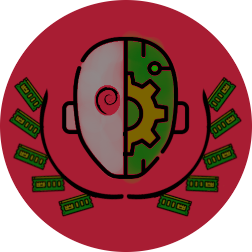

# Gaia Build System

    

Gaia is a build system to create Debian based Linux distributions. It's use Debian packages and Docker Debian containers to build the system and create reproducible builds.

The project consists of some components:

## Gaia Core

Gaia core is the main component of the project. It's the tool that parses the recipes meta-data, run the tasks and output the artifacts. It's written in TypeScript, run under Bun and uses container images to build the system.

## DeimOS

    

The DeimOS is the Debian based Linux distribution that Gaia builds as reference.
The name is a play on words with "Debian" and "OS" and a reference to the Greek god "Deimos".

## PhobOS

    

PhobOS is the Debian based and Toradex Torizon compatible Linux distribution that Gaia builds. The name is a reference to the Greek god, and brother of Deimos, Phobos.

PhobOS is more complex than DeimOS, as it has to be compatible with the Toradex Torizon ecosystem. It uses OSTree to manage the system rootfs, Aktualizr to handle updates through Torizon OTA and comes with a Docker container runtime.

> Torizon™ is a registered trademark of Toradex Group AG. Gaia project does not
talk on behalf of Toradex or on behalf of any Toradex product.

## PergamOS

    

PergamOS is the namespace for the Debian based container images library of the
Gaia project. It's a collection of Debian based images that are used to build and as a base for applications.

The PergamOS name is a reference to the ancient city of Pergamon, which was known for its library, the second largest in the ancient world, after the Library of Alexandria. Why not Alexandria then? Because Alexandria was put on fire and the library was destroyed. This is not the fate we want for our images.
